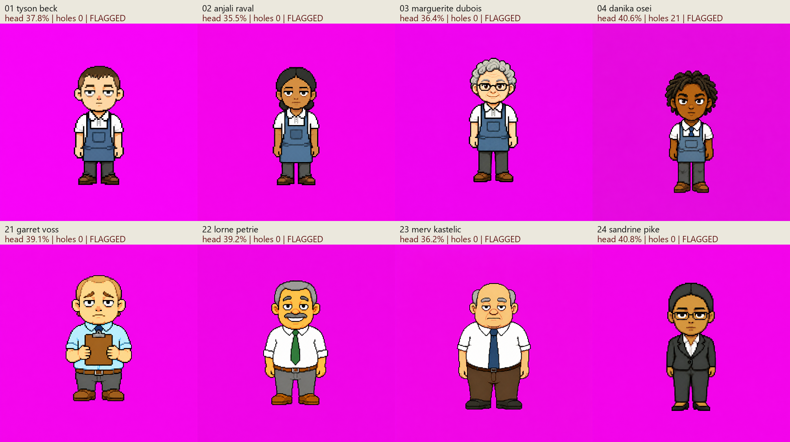

# Save-Rite Batch 1 — review candidates

**Eight masters generated and measured. All are flagged after four retries each; this is not a passing production batch. Batch 2 has not started.**

The original game sprites and index.html were not changed. All selected files are 1254×1254. Built-in image generation was used, one image per call (40 calls total). Generation prompts and original output paths are in generation-log.json; every attempt is preserved and measured.

## Build finding

The original atlas does not use one identical silhouette. In front neutral cells, Chad is 29×58, Otis 26×58, Doug 37×57 pixels. Doug is 27.6% wider than Chad; Otis is 10.3% narrower. Across 21 original slots, widths 23–37, heights 56–58. The evidence supports consistent height with varying build. These are alpha-bound silhouettes in 40×64 cells, not stored seated-canvas dimensions. Width includes arms/hair; torso-band maxima independently reproduce 29,26,37 for Chad/Otis/Doug. All four neutral facings per character are recorded in office_measurements.json.

| Office character | Width | Height | Torso band max width |
|---|---:|---:|---:|
| intern | 32 | 57 | 32 |
| sterling | 27 | 57 | 27 |
| brenda | 29 | 57 | 29 |
| marla | 25 | 58 | 25 |
| peggy | 24 | 58 | 24 |
| marcus | 29 | 57 | 29 |
| priya | 24 | 57 | 24 |
| chad | 29 | 58 | 29 |
| dana | 26 | 57 | 26 |
| otis | 26 | 58 | 26 |
| wren | 28 | 56 | 23 |
| sana | 24 | 57 | 24 |
| gil | 29 | 57 | 29 |
| ramesh | 30 | 58 | 30 |
| vera | 28 | 58 | 28 |
| doug | 37 | 57 | 37 |
| ravinder | 26 | 58 | 26 |
| hank | 27 | 58 | 27 |
| zora | 23 | 57 | 23 |
| hire_blazer | 25 | 58 | 25 |
| dale | 36 | 58 | 36 |

## Selected masters

| File | Figure W×H | Head, verified | Key pixels | Exact sealed magenta | Margin | Components | Selected attempt / retries |
|---|---:|---:|---:|---:|---:|---:|---:|
| [01_tyson_beck.png](01_tyson_beck.png) | 318×756 | 37.8% | 0 | 0 | 0 | 1 | 4 /4 |
| [02_anjali_raval.png](02_anjali_raval.png) | 296×749 | 35.5% | 0 | 0 | 0 | 1 | 2 /4 |
| [03_marguerite_dubois.png](03_marguerite_dubois.png) | 312×789 | 36.4% | 0 | 0 | 0 | 1 | 4 /4 |
| [04_danika_osei.png](04_danika_osei.png) | 334×776 | 40.6% | 21 | 0 | -188 | 1 | 3 /4 |
| [21_garret_voss.png](21_garret_voss.png) | 421×801 | 39.1% | 0 | 0 | 0 | 1 | 4 /4 |
| [22_lorne_petrie.png](22_lorne_petrie.png) | 412×791 | 39.2% | 0 | 0 | 0 | 1 | 4 /4 |
| [23_merv_kastelic.png](23_merv_kastelic.png) | 471×802 | 36.2% | 0 | 0 | 0 | 1 | 4 /4 |
| [24_sandrine_pike.png](24_sandrine_pike.png) | 314×813 | 40.8% | 0 | 0 | 0 | 1 | 3 /4 |

## Remaining failures and limits

- Every background remains off-magenta with pixel variation. Exactly 0% of each border is pure #FF00FF. These backgrounds key out with the real loader, but fail the exact-background brief. No claim of exact flat colour or no anti-aliasing is made. The 20×20 interior garment/clipboard samples and colour counts in manifest.json provide evidence of residual colour variation.

- Danika has 21 enclosed engine-key pixels near the right forearm/apron seam. They remain in the selected master. Seven others have 0. Exact pure-magenta pocket count alone is insufficient: Danika’s unsafe pixels are off-magenta. All eight are one connected component and both arms are visually connected.

- Margins are 0 on the seven hole-free masters; Danika is −188. Margin 0 survives the strict >60 rule but has no positive headroom. Exterior antialiased fringe is counted separately and is not misreported as clothing holes.

- Heights range 749–813px, median 790.0; span 8.10% of median. Head tops range [194, 299]; baselines [994, 1074]. Anchor alignment is NOT solved. Raw placement is shown in the contact sheet, not silently normalized.

- Anjali, Marguerite and Sandrine have whole-figure width/height below the narrowest front office silhouette (0.4035); measurements are in the manifest. They should not be described as fully matching the office build range.

- Head ratios use a manually identified under-chin/neck boundary checked on 3× nearest-neighbour coordinate grids, uncertainty±4px. The raw narrowest-row heuristic is retained separately. Merv is the clearest failure of the heuristic: it selects jaw level y488, whereas the anatomical boundary is y535, giving 36.2% instead of 30.3%. The audit script never alters image geometry to force a pass. Anjali is close enough to 35% that the annotation uncertainty reaches the lower limit.

- Garret’s centred two-hand clipboard is the explicit arms-down exception. No other pose exception was introduced. Bilateral accessory placement passes visual review; pixel-perfect symmetry is not claimed. Skin tone, age read, style match and identity distinctness still need Kyle’s judgement.

## Hair identity check

| Character | Hair colour | Hair silhouette |
|---|---|---|
| 01 tyson beck | dark brown | short buzzcut/fringe |
| 02 anjali raval | black | smooth centre-part low bun |
| 03 marguerite dubois | silver grey | short curls |
| 04 danika osei | black | short twists |
| 21 garret voss | sandy | thinning flat crown |
| 22 lorne petrie | grey | full compact cap |
| 23 merv kastelic | grey | bald top with side hair |
| 24 sandrine pike | black | severe smooth pulled-back cap |

No duplicate colour-plus-silhouette label within either department group. These labels were visually checked, not inferred from a histogram. They do not certify distinct faces.

## Similarity screening

Same metric for office and new masters: centre each cropped silhouette on a 160×128 canvas, normalize height to 128 while preserving aspect, compute silhouette IoU. Palette is an 8×8×8 RGB histogram over foreground pixels, compared by histogram intersection. Combined score=(IoU+intersection)/2. Larger means more similar. No threshold triggers regeneration. Source resolution and shared uniform influence scores; this is a ranking, not an identity certificate.

Office 210 pairs: min 0.466, median 0.624, max 0.768. Batch 1’s 28 pairs: min 0.469, median 0.573, max 0.836.

| Batch 1 pair | Silhouette IoU | Palette intersection | Combined |
|---|---:|---:|---:|
| 01_tyson_beck / 03_marguerite_dubois | 0.888 | 0.785 | 0.836 |
| 01_tyson_beck / 02_anjali_raval | 0.920 | 0.608 | 0.764 |
| 02_anjali_raval / 03_marguerite_dubois | 0.921 | 0.601 | 0.761 |
| 02_anjali_raval / 24_sandrine_pike | 0.911 | 0.511 | 0.711 |
| 03_marguerite_dubois / 04_danika_osei | 0.834 | 0.575 | 0.705 |
| 02_anjali_raval / 04_danika_osei | 0.822 | 0.567 | 0.694 |
| Office baseline pair | Silhouette IoU | Palette intersection | Combined |
|---|---:|---:|---:|
| priya / hire_blazer | 0.927 | 0.610 | 0.768 |
| priya / zora | 0.930 | 0.589 | 0.760 |
| sana / zora | 0.914 | 0.594 | 0.754 |
| marla / sana | 0.860 | 0.647 | 0.753 |
| otis / hank | 0.917 | 0.583 | 0.750 |
| sterling / ramesh | 0.875 | 0.625 | 0.750 |

Full matrices: [Batch1](batch1_similarity.csv), [office](office_similarity.csv). Per-pair component scores: batch1_pairs.json and office_pairs.json.

## Audit method

No global colour-key deletion is used to prepare a sprite. Audit separates border-connected background from enclosed candidate pixels: exact-magenta border flood first; for these off-magenta outputs, corner-seeded colour-region growth with L1 tolerance 45; then a separate border flood of engine-key candidates identifies exterior fringe. Enclosed engine-key pixels remain foreground and are counted. Component labelling uses 8-connectivity; border floods use 4-connectivity. Generated masters are copied byte-for-byte from tool outputs; there is no hidden recolouring or repair in the audit script.

Transparent rejected attempts use border-connected alpha<128 for visible-shape diagnostics and are explicitly marked nonconforming. Office atlas metrics use original alpha. Near-key arithmetic uses signed integers, with margin=60−max(min(R−G,B−G)).

## Review image

Open each original PNG for source-resolution review; coordinate-grid neck crops are in references/. The contact sheet is for comparison, not fine-pixel certification.

## Reproduce

Run audit.py baseline for office records; audit.py checkpoint FILE RETRIES for a candidate; finish_report.py to rebuild full diagnostics. Python dependencies: Pillow and NumPy. No game code or original sprites are edited.