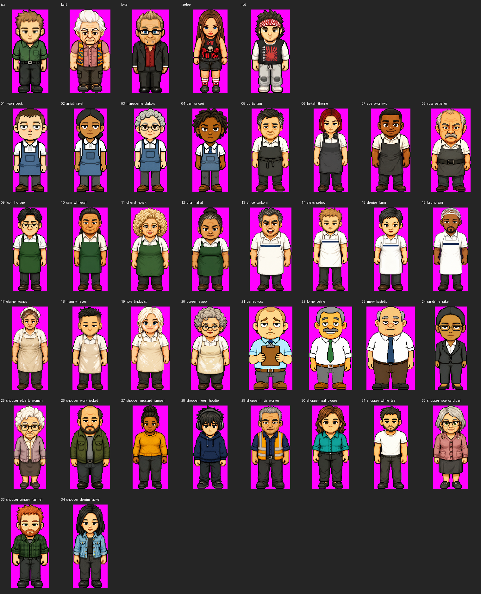

# Morning report — Save-Rite placeholder cast

## Flags and integration limits

The generated artwork is a placeholder library. Literal failures are retained below rather than labelled approved. Game code and asset registrations were not changed. Read REVIEW-NOTES.md and ANIMATION-REQUIREMENTS.md alongside this report.

- The named baseline has manually measured head ratios 35.74–42.59%, not the brief’s 34–36%. New master failures against the literal target remain listed in MASTERS.md.
- Exact figure colour counts are often below the reference range. Counts were not padded with artificial noise.
- Anjali/Priya Raval naming differs between art and live CREW. Twelve live workers need break-chair poses; twelve other staff have unresolved seated requirements because they are absent from CREW. Shoppers need no seats.
- Clipboard arm-swing and bald-character centroid exceptions remain visible. The two-band IoU test does not prove correct gait coordination; six of seven shipped profile sets fail it with the same measurement method.
- Seated chair placement and all registrations require an actual game integration test by Claude Code.

## Completion and retained failures

Selected files present: **136/136 walk strips**, **48/48 seated poses**. Technical failures: **0**. Minimum reopened key margin: **8**.

Retained profile-band failures: 14_aleks_petrov arms -0.054967; 20_doreen_stapp arms -0.047844; 21_garret_voss arms -0.190170 (clipboard exception); 22_lorne_petrie arms -0.063683; 25_shopper_elderly_woman arms -0.045758.

Visual limitations remain even on numerical passes: some exaggerated stepping, imperfect leg-tone removal and uncertain near/far limb identity. See REVIEW-NOTES.md. Exact per-strip values are in STRIP-AUDIT.md; every per-frame metric is in delivery-audit.json.

## Asset audit

| Character | Walks | Seats | Key / components / anchors | Mirror differences | Other flags |
|---|---:|---:|---|---:|---|
| 01_tyson_beck | 4/4 | 0 | pass for existing walks/seats | 0 | down colour count; down neutral W/H; up colour count; up neutral W/H; left pixel density; left colour count; left neutral W/H; right pixel density; right colour count; right neutral W/H; seated requirement unresolved |
| 02_anjali_raval | 4/4 | 4 | pass for existing walks/seats | 0 | down pixel density; down colour count; down neutral W/H; up pixel density; up colour count; up neutral W/H; left pixel density; left colour count; left neutral W/H; right pixel density; right colour count; right neutral W/H |
| 03_marguerite_dubois | 4/4 | 4 | pass for existing walks/seats | 0 | down pixel density; down colour count; down neutral W/H; up pixel density; up colour count; up neutral W/H; left pixel density; left colour count; left neutral W/H; right pixel density; right colour count; right neutral W/H |
| 04_danika_osei | 4/4 | 4 | pass for existing walks/seats | 0 | down pixel density; down colour count; up pixel density; up colour count; up neutral W/H; left pixel density; left colour count; left neutral W/H; right pixel density; right colour count; right neutral W/H |
| 05_curtis_lam | 4/4 | 4 | pass for existing walks/seats | 0 | down colour count; up pixel density; up colour count; left pixel density; left colour count; left neutral W/H; right pixel density; right colour count; right neutral W/H |
| 06_bekah_thorne | 4/4 | 4 | pass for existing walks/seats | 0 | down colour count; down neutral W/H; up colour count; up neutral W/H; left pixel density; left colour count; left neutral W/H; right pixel density; right colour count; right neutral W/H |
| 07_ade_okonkwo | 4/4 | 0 | pass for existing walks/seats | 0 | down pixel density; down colour count; up colour count; left pixel density; left colour count; left neutral W/H; right pixel density; right colour count; right neutral W/H; seated requirement unresolved |
| 08_russ_pelletier | 4/4 | 4 | pass for existing walks/seats | 0 | down pixel density; down colour count; up colour count; left pixel density; left colour count; left neutral W/H; right pixel density; right colour count; right neutral W/H |
| 09_joon_ho_bae | 4/4 | 0 | pass for existing walks/seats | 0 | down colour count; down neutral W/H; up pixel density; up colour count; up neutral W/H; left pixel density; left colour count; left neutral W/H; right pixel density; right colour count; right neutral W/H; seated requirement unresolved |
| 10_sam_whitecalf | 4/4 | 0 | pass for existing walks/seats | 0 | down pixel density; down colour count; down neutral W/H; up pixel density; up colour count; up neutral W/H; left centroid inconclusive/failed; left pixel density; left colour count; left neutral W/H; right centroid inconclusive/failed; right pixel density; right colour count; right neutral W/H; seated requirement unresolved |
| 11_cheryl_novak | 4/4 | 0 | pass for existing walks/seats | 0 | up pixel density; up colour count; left colour count; left neutral W/H; right colour count; right neutral W/H; seated requirement unresolved |
| 12_gita_mahal | 4/4 | 4 | pass for existing walks/seats | 0 | down pixel density; down colour count; up pixel density; up colour count; up neutral W/H; left pixel density; left colour count; left neutral W/H; right pixel density; right colour count; right neutral W/H |
| 13_vince_carboni | 4/4 | 0 | pass for existing walks/seats | 0 | down colour count; up pixel density; up colour count; left pixel density; left colour count; left neutral W/H; right pixel density; right colour count; right neutral W/H; seated requirement unresolved |
| 14_aleks_petrov | 4/4 | 0 | pass for existing walks/seats | 0 | down pixel density; down colour count; up pixel density; up colour count; up neutral W/H; left arms IoU; left pixel density; left colour count; left neutral W/H; right arms IoU; right pixel density; right colour count; right neutral W/H; seated requirement unresolved |
| 15_denise_fung | 4/4 | 0 | pass for existing walks/seats | 0 | down pixel density; down colour count; up pixel density; up colour count; left pixel density; left colour count; left neutral W/H; right pixel density; right colour count; right neutral W/H; seated requirement unresolved |
| 16_bruno_sarr | 4/4 | 4 | pass for existing walks/seats | 0 | down pixel density; down colour count; up colour count; left centroid inconclusive/failed; left pixel density; left colour count; left neutral W/H; right centroid inconclusive/failed; right pixel density; right colour count; right neutral W/H |
| 17_elaine_kovacs | 4/4 | 0 | pass for existing walks/seats | 0 | down pixel density; down colour count; up pixel density; up colour count; left pixel density; left colour count; left neutral W/H; right pixel density; right colour count; right neutral W/H; seated requirement unresolved |
| 18_manny_reyes | 4/4 | 0 | pass for existing walks/seats | 0 | down pixel density; down colour count; up pixel density; up colour count; left pixel density; left colour count; left neutral W/H; right pixel density; right colour count; right neutral W/H; seated requirement unresolved |
| 19_tova_lindqvist | 4/4 | 0 | pass for existing walks/seats | 0 | down colour count; up pixel density; up colour count; left pixel density; left colour count; left neutral W/H; right pixel density; right colour count; right neutral W/H; seated requirement unresolved |
| 20_doreen_stapp | 4/4 | 4 | pass for existing walks/seats | 0 | down pixel density; down colour count; up pixel density; up colour count; left arms IoU; left pixel density; left colour count; left neutral W/H; right arms IoU; right pixel density; right colour count; right neutral W/H |
| 21_garret_voss | 4/4 | 4 | pass for existing walks/seats | 0 | down arms IoU (clipboard exception); down pixel density; down colour count; up arms IoU (clipboard exception); up pixel density; up colour count; left arms IoU (clipboard exception); left centroid inconclusive/failed; left pixel density; left colour count; left neutral W/H; right arms IoU (clipboard exception); right centroid inconclusive/failed; right pixel density; right colour count; right neutral W/H |
| 22_lorne_petrie | 4/4 | 4 | pass for existing walks/seats | 0 | down pixel density; down colour count; up colour count; left arms IoU; left pixel density; left colour count; left neutral W/H; right arms IoU; right pixel density; right colour count; right neutral W/H |
| 23_merv_kastelic | 4/4 | 4 | pass for existing walks/seats | 0 | down pixel density; down colour count; down neutral W/H; up pixel density; up colour count; up neutral W/H; left centroid inconclusive/failed; left pixel density; left colour count; left neutral W/H; right centroid inconclusive/failed; right pixel density; right colour count; right neutral W/H |
| 24_sandrine_pike | 4/4 | 0 | pass for existing walks/seats | 0 | down pixel density; down colour count; down neutral W/H; up pixel density; up colour count; up neutral W/H; left pixel density; left colour count; left neutral W/H; right pixel density; right colour count; right neutral W/H; seated requirement unresolved |
| 25_shopper_elderly_woman | 4/4 | 0 | pass for existing walks/seats | 0 | down pixel density; down colour count; down neutral W/H; up colour count; up neutral W/H; left arms IoU; left pixel density; left colour count; left neutral W/H; right arms IoU; right pixel density; right colour count; right neutral W/H |
| 26_shopper_work_jacket | 4/4 | 0 | pass for existing walks/seats | 0 | down pixel density; down colour count; up pixel density; up colour count; left centroid inconclusive/failed; left pixel density; left colour count; left neutral W/H; right centroid inconclusive/failed; right pixel density; right colour count; right neutral W/H |
| 27_shopper_mustard_jumper | 4/4 | 0 | pass for existing walks/seats | 0 | down pixel density; down colour count; down neutral W/H; up pixel density; up colour count; up neutral W/H; left pixel density; left colour count; left neutral W/H; right pixel density; right colour count; right neutral W/H |
| 28_shopper_teen_hoodie | 4/4 | 0 | pass for existing walks/seats | 0 | down pixel density; down colour count; down neutral W/H; up pixel density; up colour count; up neutral W/H; left pixel density; left colour count; left neutral W/H; right pixel density; right colour count; right neutral W/H |
| 29_shopper_hivis_worker | 4/4 | 0 | pass for existing walks/seats | 0 | down pixel density; down colour count; up pixel density; up colour count; left pixel density; left colour count; left neutral W/H; right pixel density; right colour count; right neutral W/H |
| 30_shopper_teal_blouse | 4/4 | 0 | pass for existing walks/seats | 0 | down pixel density; down colour count; up pixel density; up colour count; left pixel density; left colour count; left neutral W/H; right pixel density; right colour count; right neutral W/H |
| 31_shopper_white_tee | 4/4 | 0 | pass for existing walks/seats | 0 | down pixel density; down colour count; down neutral W/H; up pixel density; up colour count; up neutral W/H; left pixel density; left colour count; left neutral W/H; right pixel density; right colour count; right neutral W/H |
| 32_shopper_rose_cardigan | 4/4 | 0 | pass for existing walks/seats | 0 | down pixel density; down colour count; down neutral W/H; up pixel density; up colour count; up neutral W/H; left pixel density; left colour count; left neutral W/H; right pixel density; right colour count; right neutral W/H |
| 33_shopper_ginger_flannel | 4/4 | 0 | pass for existing walks/seats | 0 | down pixel density; down colour count; up pixel density; up colour count; left pixel density; left colour count; left neutral W/H; right pixel density; right colour count; right neutral W/H |
| 34_shopper_denim_jacket | 4/4 | 0 | pass for existing walks/seats | 0 | down colour count; up pixel density; up colour count; up neutral W/H; left pixel density; left colour count; left neutral W/H; right pixel density; right colour count; right neutral W/H |

## Masters and cast comparison

See MASTERS.md for all 18 new master W/H, anatomical head ratios, pixel sizes, colours and flags. Both #25 lavender and #32 dusty rose have independently reopened margin **8**, no holes and one component. Deli and Bakery use flat neck-loop bib aprons with waist ties; they read as aprons rather than trouser-leg dungarees.

## Similarity screening

Closest master pairs: Sam Whitecalf / Gita Mahal **0.83869**; Aleks Petrov / Denise Fung **0.83110**; Tyson Beck / Marguerite Dubois **0.82808**. The five named baseline’s closest pair is Jax / Kyle **0.76381**. This is a review ranking, not certification or a regeneration trigger; uniforms dominate some comparisons. Complete rankings are in all34_pairs.json and current-five_pairs.json.

## Format and handoff

Walk PNGs: 552×295, three 184×295 cells, stride / neutral / opposite stride; idle index 1, cycle [0,1,2,1]. New normalized figures have top y16 and last content row y277. Right strips mirror each left frame without reversing frame order. Seated PNGs are person-only, 416×416; content bottom edge 388, heights down360/up323/side295. See ANIMATION-REQUIREMENTS.md for renderer scaling and per-character code evidence.

Built-in image generation was used. Exact per-output prompts and references are in prompts/. Raw generations and retries are retained in animation-raw/ and masters-raw/. outputs.jsonl checkpoints each output. The approved Batch 1 Light and Batch 2 masters were preserved.